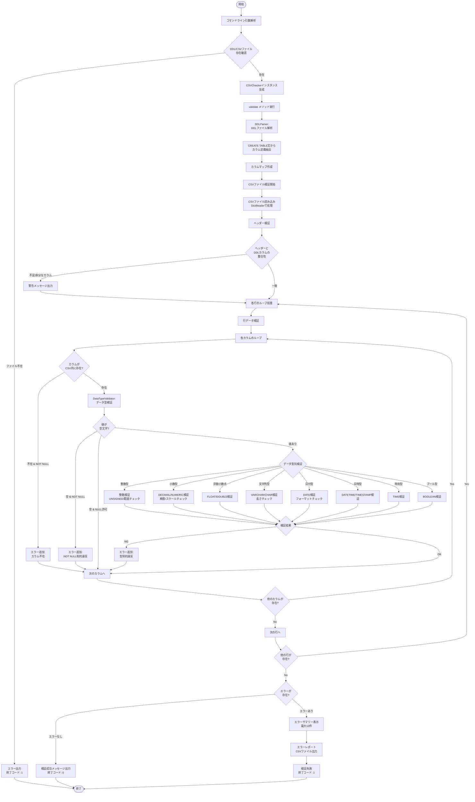
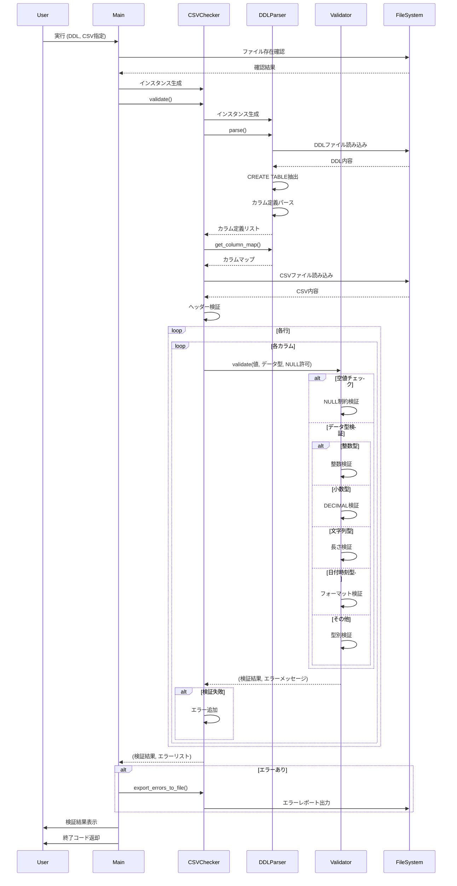

# CSVインポート事前チェックツール - 処理の流れ

## 概要
このツールは、DDLファイル（CREATE TABLE定義）とCSVファイルを比較し、CSVデータがテーブル定義に適合するかを検証します。

## 全体の処理フロー



## モジュール構成と役割

### 1. main.py
**役割**: エントリーポイント・CLI制御
- コマンドライン引数の解析
- ファイル存在確認
- CSVCheckerの実行制御
- 結果の表示と終了コード制御

### 2. csv_checker.py
**役割**: 検証のメインロジック
- DDLParserとDataTypeValidatorの統合
- CSVファイルの読み込みと行ごとの処理
- ヘッダー検証
- エラー情報の収集と出力

**主要クラス**:
- `ValidationError`: エラー情報を保持するデータクラス
- `CSVChecker`: 検証処理のメインクラス

### 3. ddl_parser.py
**役割**: DDL解析
- DDLファイルからCREATE TABLE文を抽出
- カラム定義（名前、データ型、NULL制約）のパース
- カラム情報を構造化データとして提供

**主要クラス**:
- `ColumnDefinition`: カラム定義を保持するデータクラス
- `DDLParser`: DDL解析クラス

### 4. validator.py
**役割**: データ型別のバリデーション
- 各データ型に応じた検証ロジック
- 型固有の制約チェック（範囲、精度、フォーマット等）

**対応データ型**:
- 整数型: INT, BIGINT, SMALLINT, TINYINT（UNSIGNED対応）
- 小数型: DECIMAL, NUMERIC（精度/スケール検証）
- 浮動小数点型: FLOAT, DOUBLE
- 文字列型: VARCHAR, CHAR（長さ検証）
- 日付時刻型: DATE, DATETIME, TIMESTAMP, TIME
- ブール型: BOOLEAN, BOOL
- テキスト型: TEXT

## 詳細な処理シーケンス



## エラーハンドリング

### 終了コード
- **0**: 検証成功（全レコードが適合）
- **1**: 検証失敗（エラーあり）、またはファイル不在
- **2**: 実行時例外

### エラーの種類
1. **ファイルレベル**
   - DDL/CSVファイルが存在しない
   - ファイル読み込みエラー
   - CSVヘッダーが存在しない

2. **スキーマレベル**
   - DDLに定義されているがCSVに存在しないカラム（警告）
   - CSVに存在するがDDLに定義されていないカラム（警告）

3. **データレベル**
   - NOT NULL制約違反
   - データ型不一致
   - 範囲外の値（整数型）
   - 精度/スケール超過（DECIMAL/NUMERIC）
   - 文字列長超過（VARCHAR/CHAR）
   - フォーマット不正（日付時刻型）
   - UNSIGNED制約違反

## 出力形式

### コンソール出力
- ツール実行情報（ファイルパス、エンコーディング）
- DDL解析結果（カラム数、カラム定義）
- ヘッダー検証の警告
- 検証結果（成功/失敗）
- エラーサマリー（最大10件表示）

### エラーレポートファイル (CSV)
```csv
行番号,カラム名,値,エラー内容
2,"age","abc","整数ではありません"
3,"email","verylongemail@example.com","文字列長が50を超えています（実際: 55）"
```

## 使用例

```bash
# 基本的な使用法
python3 main.py --ddl users.sql --csv users.csv

# エンコーディング指定
python3 main.py --ddl users.sql --csv users.csv --encoding shift_jis

# 出力ファイル指定
python3 main.py --ddl users.sql --csv users.csv --output errors.csv
```

## 拡張性

このツールは以下の拡張が可能です:
- 新しいデータ型のサポート追加（`validator.py`）
- カスタム制約の追加（UNIQUE, CHECK等）
- 複数テーブルの同時検証
- JSON/XML等の他フォーマット対応
- データベース直接接続機能
